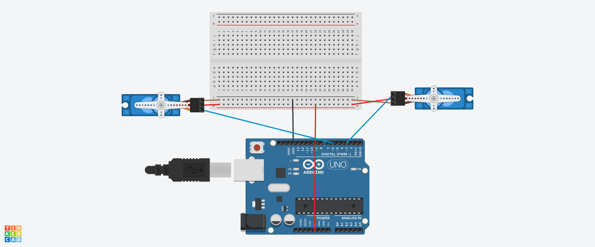

# Servomotor

This project demonstrates how to control **two servo motors** to rotate in **opposite directions** using an Arduino Uno. While one servo rotates from 0° to 180°, the other rotates from 180° to 0°, creating a mirrored motion.

## 📷 Circuit Diagram

 

## 🛠️ Components

- Arduino Uno
- 2x SG90 Servo Motors
- Breadboard
- Jumper Wires
- USB Cable

## ⚙️ How It Works

- The project uses the `Servo` library.
- The first servo moves from 0° to 180°.
- The second servo moves from 180° to 0° at the same time.
- The process repeats in a loop.

